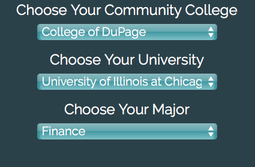
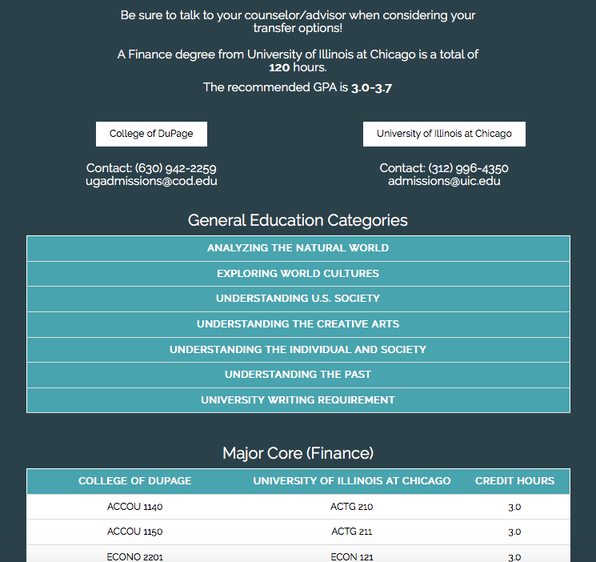
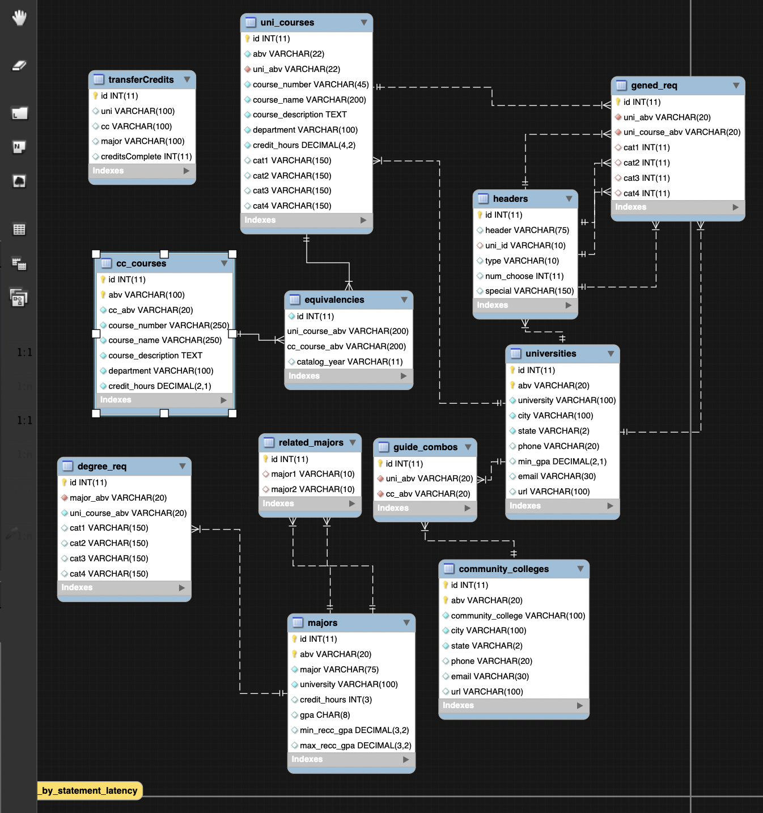

# Clearmaze Web Application

## What is it?
Clearmaze Technologies, Inc. was an educational technology company that helps community college students identify the courses that will transfer to a four-year university with 3 simple steps:
1. choose the community college
2. choose the university
3.  choose the major.

## How is it built?
The Web Application was built off of the LAMP Stack and utilizes the following Web Technologies:
- MySQL Backend: store course information and relationships
- PHP Server Side Scripting Language: used mainly to run SQL Queries to retrieve course information
- Twitter Bootstrap: Front-end mobile responsiveness
- AJAX Calls: Make a Single Page Application by loading different pages into the main pages
- ChartJS: make dashboards with graphs
- AngularJS: used in an isolated environment to make an analytic dashboards for institutions. Was not used in main application

## Transfer Guide Generator

  

The essence of our web application. A simple 3 step to get all your courses.

  

Here is a real guide generated from selection of the 3 dropdown menus. Making access to valuable course information super fast!

### Some features
- courses required for degree categorized by General Educational requirements
- course number AND course name available in a single view!
- credit hours
- important contact information right there!

## Backend database

  

  <i>Schema for course equivalencies database.</i>

## Administrative Analytics Dashboard

The Analytics Dashboard allowed administration to view insights into students using the platform.

**Features Included**
- accessed using a subdomain: admin.clearmaze.net
- Most searched major for given time-frame.
- Entire list of transfer guides a given student has queried.  (Including ones belonging to a different institution)
- Average age, GPA, as well as male-to-female ratio of prospective students.
- List of prospective students who are most interested in a specific university ranked by a specific score generated from a custom algorithm.
